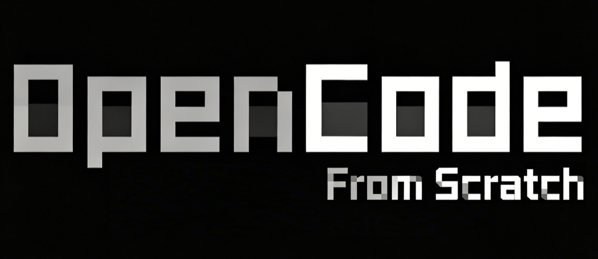

<div align="center">



# 🤖 OpenCode From Scratch

**从零开始，一行一行重新实现 [opencode](https://opencode.ai) —— 一个开源 AI 编程 Agent**

[](https://bun.sh)
[](https://www.typescriptlang.org)
[](https://effect.website)
[](https://github.com/anomalyco/opencode)
[](./COURSE.md)

[项目由来](#-为什么有这个项目) · [学习路线](#️-学习路线) · [快速开始](#-快速开始) · [课程文档](./COURSE.md)

</div>

---

## 📦 这是什么

一个**教学项目**：从最简化的能跑版本起步，逐步演进到 opencode 的完整 **1:1 复刻**。

| | |
|---|---|
| 📌 参考版本 | opencode `v1.17.13`（commit `10c894bde`，分支 `dev`） |
| 📂 源码参考 | [`./opencode/`](./opencode)（只读，不修改） |
| 🎯 最终目标 | opencode 的完整 1:1 复刻 |
| 👤 适合人群 | 会 Python、想搞懂 AI coding agent 内部原理的开发者 |

opencode 的核心是一个 **agent loop**：

```
接收用户指令 → 组装上下文 → 调用 LLM → 执行工具调用 → 结果喂回 LLM → 循环直到完成
```

看起来简单，但生产级实现涉及大量架构决策：怎么管理依赖、怎么持久化状态、怎么处理流式、怎么解耦 UI 与业务逻辑、怎么支持多 LLM 厂商……

> 这个项目不是"跟着我敲"的教程，而是**"一起想清楚为什么"**。每段代码都应该能回答"为什么这样写"。

---

## 🤔 为什么有这个项目

**编码变得廉价，架构变得昂贵。**

AI 时代，一句"帮我写个 XXX"就能产出能跑的代码。但很快你会发现——问题从来不在编码本身，而在怎么设计、怎么组织、怎么验证。无脑 vibe coding 的项目开头几天爽得飞起，越到后期越力不从心：改一处崩三处、bug 层出不穷、代码像一团乱麻，最后变成"能跑但不敢碰"的怪物。这不是 AI 的问题，是**架构**的问题——AI 帮你砌好了每一块砖，但没有蓝图，砖堆得越多越容易塌。

**我是一名算法工程师，Python/Cpp 技术栈，前后端完全不会。**

想直接读 opencode 源码——太难了：import 层层嵌套、Effect 服务绕来绕去、Stream 流转不停，读到第三个文件就迷路。根本原因是我**欠缺的技术栈太多**：**TypeScript / Bun / npm workspaces** 整个 JS 生态没碰过；**JSX / 组件 / 响应式（createSignal）** 不会任何前端；**HTTP 服务 / ORM / 数据库迁移** 没做过一天后端；**Effect-TS / Stream / 事件溯源** 函数式编程和异步范式完全陌生；**Service / Layer / 依赖注入 / Schema 运行时校验** 这些"生产级架构"概念工作中根本接触不到；连 **opentui 在终端画 UI**、**Electron 打包桌面应用** 都听都没听过。退一步做几个小项目练手，又撞上同样的"爽快开始、混乱中段、放弃收尾"。这才意识到：**小项目也需要架构。** 我缺的不是编码能力（AI 补上了），而是架构思维。既然如此，为什么不直接学一个经过真实用户检验的生产级软件？于是又转回了 opencode，只是换了个学法。

**转变：边造东西边学技术，而不是先学完技术再造东西。**

复刻 opencode 这个目标，天然适合让 AI + agent 来拆解——用到 Effect 的 Service 就让它讲 Service，用到 Drizzle 的表设计就让它讲表设计，**用到什么学什么**，不必提前啃完一整本教程。更关键的是，AI 出的讲义可以反复 battle：看不懂就换个说法，还不懂就用 Python 类比，太抽象就给生活例子——一遍遍打磨到你真正理解为止。这是传统教育做不到的。

> **先感受到痛点，再学解决方案，理解才深刻。**

---

## 🎓 你能学到什么

> **整个教程最最重要的一课：学会 debug。**
> 现在 AI 让代码跑通越来越容易，但“跑通”和“看懂”是两回事。真正搞明白一段代码怎么运转，最有效的办法就是去 debug 它：读报错栈、追数据流、定位根因、验证假设，每一步都逼着你把系统的里子翻出来看。写代码可以交给 AI，理解代码得靠 debug。

- **opencode 的设计决策**——不只是当用户用，而是理解它内部每一个决策：为什么用 Effect-TS、为什么用事件溯源、为什么拆成 31 个 package
- **用 AI agent 为自己定制教程**——本项目的课程本身就是 AI agent 辅助生成的。你能学到怎么把庞大知识点拆碎、怎么和 AI 反复打磨讲义、怎么让它用你能懂的方式解释陌生概念
- **一条真实的学习路线**——每个阶段都有"工程思维总结"，记录踩过的坑、想通的瞬间、为什么这样设计而非那样

> 这个项目的真正价值不是"教会你 opencode 怎么写"，而是**展示一种 AI 时代的学习方法**：边造边学，让 AI 把每个知识点讲到你能懂。

---

## 🗺️ 学习路线

核心原则：**动机驱动 + 渐进演进** —— 不是"opencode 有什么就照搬什么"，而是"哪里痛了才引入什么"。

### 第一阶段 · 简化版能跑 ✅

用最少的抽象把 agent loop 跑通，理解核心机制。

| 阶段 | 内容 | 状态 |
|:---:|---|:---:|
| 0 | 环境与基础（TypeScript + Bun 起步） | ✅ |
| 1 | 最小 Agent（一次 LLM 调用） | ✅ |
| 2 | 流式输出 | ✅ |
| 3 | 工具循环（Agent 的核心） | ✅ |
| 4 | 工具集（read / write / edit / bash / grep / glob） | ✅ |
| 5 | Session 持久化（SQLite + Drizzle） | ✅ |
| 6 | Provider 抽象 | ✅ |
| 7 | System Context & AGENTS.md | ✅ |
| 8 | CLI 入口（yargs） | ✅ |
| 9 | TUI 终端界面（opentui / solid） | ✅ |

### 第二阶段 · 演进到 1:1 复刻 🔧

每个阶段因为一个具体痛点，引入 opencode 的对应抽象。

| 阶段 | 解决的痛点 | 引入的抽象 | 状态 |
|:---:|---|---|:---:|
| 10 | 依赖到处传 | Effect Service / Layer / Stream / Schema | 🔧 |
| 11 | 类型重复、边界模糊 | Schema 契约层 + Bun workspaces | ⏳ |
| 12 | 领域逻辑散乱 | Core 领域服务化 | ⏳ |
| 13 | 无法 revert / 恢复 / 压缩 | Session 事件溯源 | ⏳ |
| 14 | 加 provider 要复制粘贴 | LLM Route 四轴模型 | ⏳ |
| 15 | TUI 与 agent 耦合 | Server + Protocol + Client | ⏳ |
| 16 | 工具能乱改无确认 | Permission 系统 | ⏳ |
| 17 | 单 agent 干所有事 | Agent 定义 + Subagent | ⏳ |
| 18 | 工具不够用 | 完整工具集 | ⏳ |
| 19 | 工具扩展要改源码 | MCP 支持 | ⏳ |
| 20 | 长对话爆上下文 | Compaction + revert + plugin + LSP | ⏳ |
| 21 | 只有 TUI | Web UI + Desktop | ⏳ |

> 完整课程大纲与当前进度见 **[COURSE.md](./COURSE.md)**（活文档，进入每阶段前才细化）。

---

## 🛠️ 技术栈

| 技术 | 作用 | 对应 Python 概念 |
|------|------|------------------|
| **Bun** | JS 运行时 + 包管理器 | Python 解释器 + pip / uv |
| **TypeScript** | 编程语言 | 带类型标注的 Python |
| **Effect-TS** | 函数式框架（Service / Layer / Stream / Schema） | 带依赖注入的 async + Result 类型 |
| **Drizzle ORM** | SQLite ORM | SQLAlchemy |
| **yargs** | CLI 参数解析 | argparse / click |
| **opentui / solid** | 终端 UI 框架 | 无直接对应；类似 React 但渲染在终端 |

---

## 🚀 快速开始

> 前置：已安装 [Bun](https://bun.sh)。

```bash
# 1. 克隆并安装依赖
git clone https://github.com/hong-kailin/OpenCodeFromScratch.git
cd OpenCodeFromScratch
bun install

# 2. 配置 LLM（复制模板后填入你自己的 baseURL / apiKey / model）
#    opencode.json 支持任意 OpenAI 兼容的 provider

# 3. 运行
bun run dev            # CLI 交互模式
bun run dev run "你好"  # 非交互模式（发一条消息后退出）
bun run tui            # TUI 终端界面
```

`opencode.json` 配置示例：

```jsonc
{
  "$schema": "https://opencode.ai/config.json",
  "model": "<provider>/<model-id>",
  "provider": {
    "<provider>": {
      "name": "你的 Provider 名称",
      "baseURL": "https://api.example.com/v1",
      "apiKey": "在这里填入你自己的 key",
      "models": { "<model-id>": {} }
    }
  }
}
```

> ⚠️ 不要把真实 `apiKey` 提交到 git。建议用环境变量或本地未跟踪的配置文件管理密钥。

---

## 📂 项目结构

```
OpenCodeFromScratch/
├── opencode/          # opencode 源码（只读参考，不修改）
├── docs/              # 课程文档（按 阶段 / 小课 编号组织）
├── src/               # 项目代码
│   ├── index.ts       # CLI 入口
│   ├── agent-loop.ts  # agent loop 核心逻辑
│   ├── provider/      # LLM Provider（OpenAI / Anthropic）
│   ├── tool/          # 工具实现（read / write / edit / bash / grep / glob）
│   ├── service/       # Effect Service（ConfigService 等）
│   ├── tui/           # 终端 UI（opentui / solid）
│   └── ...
├── COURSE.md          # 课程大纲（活文档）
├── AGENTS.md          # 项目约定与 AI 助手指令
└── README.md          # 你正在看的这个
```

---

## 💬 给同样想学的人

如果你也是"会 Python 但不会前端"的算法工程师，也想知道 AI coding agent 内部到底怎么运转——这个项目就是为你写的。

你**不需要**先看完 TypeScript 教程，**不需要**先学 React，**不需要**先理解函数式编程。只需要跟着阶段 0 开始，写第一行 `console.log("hello")`，然后一步一步往前走。遇到不懂的概念，课程里会讲；遇到不懂的语法，边写边查。

<div align="center">

**📖 读一万篇 agent 架构文章，不如亲手写一个。**

</div>
